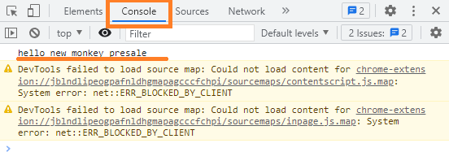
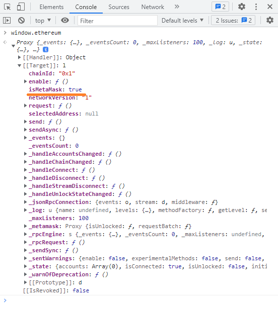
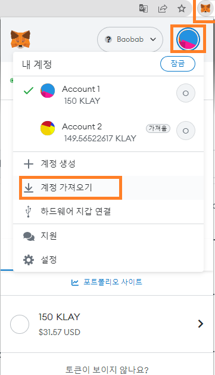
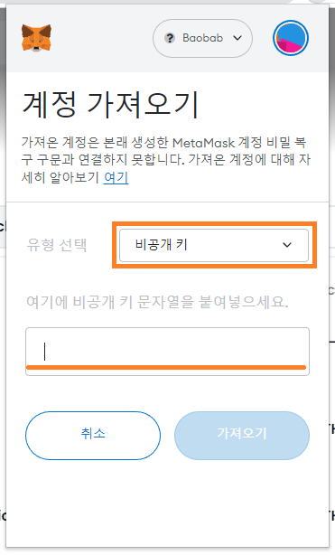
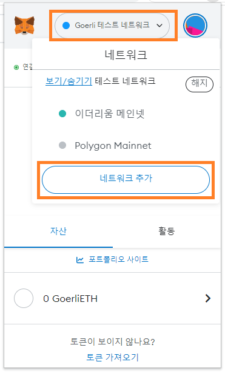
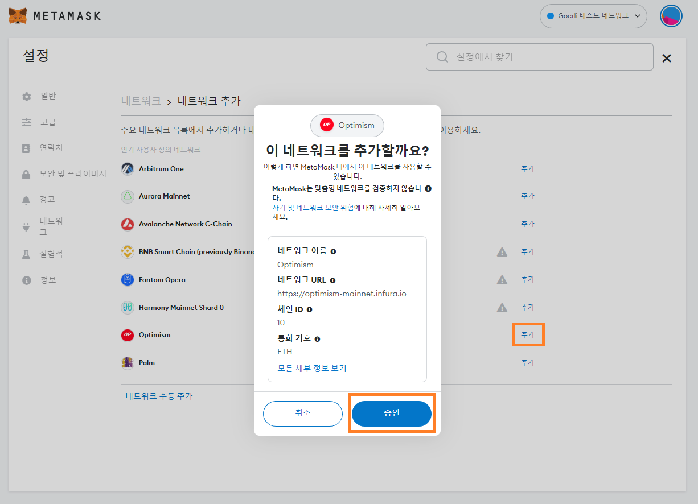

# **섹션 9 - Presale - Front-End with Metamask *** :spider_web:

(TODO)
  
# Web Server(lite-server) 만들기

- lite-server는 가벼운 웹 어플리케이션을 만들기 위한 라이브러리입니다.

- /frontend/ 폴더 생성

- 경로 이동

    ```cd frontend```

- npm으로 project 생성

    ```npm init -y```

- lite-server 설치
    
    ```npm install --save-dev lite-server```

- browserify 설치

    ```npm install --save-dev browserify```

- browserify는 

- lite-server 실행
    
    ```npx lite-server```

- /frontend/index.html 추가 (파일 이름 변경하시면 안됩니다.)

    ```
    (TODO)
    ```

- /frontend/js/ 폴더 생성

- /frontend/js/app.js 파일 추가
    
    ```
    (TODO)
    ```

- package.json scripts 추가

    ```
    "start": "lite-server",
    "pack": "browserify ./js/app.js -o ./js/bundle.js",
    ```

- 실행중인 lite-server 실행중지 (lite-server가 2개 띄워져 있으면 안됩니다.)

    Windows : Ctrl + c
    Mac : Command + c

- npm 으로 lite-server 실행

    ```npm run start```

- /frontend/index.html 파일에서 app.js 파일 로딩하기

    ```
    <script src="js/app.js"></script>
    ```

- /frontend/app.js 파일에 로그 출력 메세지 추가

    ```
    console.log('hello new monkey presale');
    ```

- Chrome 개발자 도구에서 확인

    

- Chrome 개발자 도구에서 window.ethereum 확인하기

    

    - Metamask가 설치되어 있다면 window.ethereum 오브젝트가 생성됩니다. 이 오브젝트를 이용하여 Metamask와 상호작용할 수 있습니다. 
    
    - 하지만 다른 Wallet도 window.ethereum 오브젝트를 생성하는 경우가 있어 같은 브라우저에 window.ethereum을 사용하는 Wallet이 2개 이상 설치되어 있으면 원하는대로 동작하지 않습니다.

    - 그래서 이런경우 둘중에 한개의 Wallet은 삭제를 하셔야 하고 window.ethereum.isMetaMask라는 변수로 지금 생성되어 있는 window.ethereum 오브젝트가 Metamask가 생성한 오브젝트가 맞는지를 확인하는 변수가 존재합니다.

- app.js 스크립트 만들기

    - Metamask 설치 확인

        ```
        if (window.ethereum && window.ethereum.isMetaMask == true) {
            console.log('ready metamask');
        } else {
            console.log('no metamask');
        }
        ```

    - Metamask Event 코드 추가

        ```
        window.ethereum.removeAllListeners();

        window.ethereum.on('accountsChanged', accounts => {
            console.log('on accountsChanged: ' + JSON.stringify(accounts));
        });

        window.ethereum.on('chainChanged', chainId => {
            console.log('on chainChanged: ' + JSON.stringify(chainId));
        });

        window.ethereum.on('connect', connectInfo => {
            console.log('on connect: ' + JSON.stringify(connectInfo));
        });

        window.ethereum.on('disconnect', error => {
            console.log('on disconnect: ' + JSON.stringify(error));
        });

        window.ethereum.on('message', message => {
            console.log('on message: ' + JSON.stringify(message));
        });
        ```
    
    - 신규 계정 생성하기

        - 새 터미널 열기 (or project root로 이동)

        - 신규 계정 생성
        
            ```npx hardhat run --network baobab .\src\wallet\create-key.ts```

        - 생성된 계정 Metamask에 추가하기

            - Chrome Metamask Extension 아이콘 클릭
            - 내 계정 아이콘 클릭
            - 계정 가져오기 클릭
            
                

            - 유형 선택에서 비공개키를 선택
            - Private key(:warning:Mnemonic 아닙니다 :warning:)를 입력 하고 가져오기 버턴 클릭
            
                

    - 네트웍 추가하기 (이미 네트웍이 2개 이상이신분은 안하셔도 됩니다.)

        - Chrome Metamask Extension 아이콘 클릭
        - 상단 네트웍크 ComboBox 클릭
        - 네트워크 추가 버턴 클릭
        
            

        - 목록에 있는 아무 네트웍이나 추가버턴을 클릭하고 승인 클릭

            

    - Metamask 가지고 놀기

        계정 