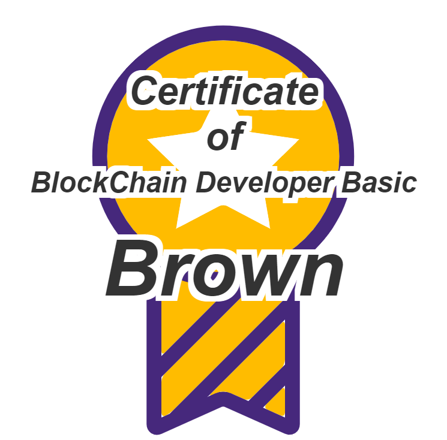

# **Section 11 - Finish** :thumbsup:

# 강의 Review
## Section 1 - 환경설정 :gear:
- Visual Studio 소개
- Node.js 소개
- Visual Studio 설치
- Node.js 설치

## Section 2 - 프로젝트 생성 :gear:
- npm packages 설치
- hardhat.config.ts
- VSCode Extentions 설치
- settings.json, tsconfig.json 파일 추가

## Section 3 - Smart Contract 만들기 :rocket:

- Solidity 소개
- sol 파일 기본구조 소개
- Greeter.sol Compile
- EOA, CA
- eth_call, eth_sendTransaction
- Greeter.sol 진화시키기

## Section 4 - Unit Test 만들기 :yum:
- Unit Test 소개
- Unit Test 기본 구조
- Typechain 파일 만들기
- Greeter.sol Unit Test 만들기

## Section 5 - Smart Contract with Klaytn :spider_web:
- Klaytn network 소개
- EOA 생성
- .env
- hardhat.config.ts
- Deploy Greeter to Klaytn
- Interaction with Smart Contract

## Section 6 - ERC20 :moneybag:
- OpenZeppelin 소개
- ERC20 소개
- ERC20 내 코인 만들기
- Momo Coin UnitTest 만들기
- Deploy Momo Coin to Klaytn
- Momo Coin Balance 가져오기

## Section 7 - ERC721 :monkey_face:
- ERC721 소개
- ERC721 My NFT 만들기
- Monkey NFT UnitTest 만들기
- Deploy Monkey NFT to Klaytn
- Mint Monkey NFT

## Section 8 - Opensea :boat:
- Opensea & Metamask 소개
- Metamask 설치
- Edit My Collection
- Refresh Metadata

## Section 9 - Presale - Contract :rocket:
- NewMonkey Contract 만들기
- NewMonkey NFT UnitTest 만들기
- Deploy NewMonkey NFT to Klaytn
- Mint NewMonkey NFT
- NewMonkey NFT Train

## Section 10 - Presale - Front-End with Metamask :spider_web:
- Web Server(lite-server) 만들기
- Metamask Test 환경 만들기
- Metamask 연동

# 강의를 마치며

- 이 강의는 저는 블록체인 개발의 Hello world라고 생각하고 있습니다.
- 비 개발자분들에게는 블록체인 개발에 대한 기본적인 지식을 쌓게 해주고 개발자 분들에게는 스스로 학습할 수 있는 기회를 제공할 수 있다고 생각하고 있습니다. 
- 혹시 너무 어렵다고 느끼시거나 난해하다고 느끼신다면 당연한 현상이라고 생각합니다. 이제 첫발을 내 디딘 거니까요. :sob:
- 강의에 부족한 점이 있다면 알려주시면 감사하겠습니다.!!

# 숙제
아래 정보를 이용하여 스스로 mint하여 수료증을 발급받자!!

- Network : Klaytn baobab
- Deployed Contract 정보

    <details>
    <summary>BasicCertificate.sol</summary>

    ```solidity
    //SPDX-License-Identifier: MIT

    pragma solidity 0.8.17;

    import "@openzeppelin/contracts/token/ERC721/ERC721.sol";
    import "hardhat/console.sol";

    import "@openzeppelin/contracts/access/Ownable.sol";
    import "@openzeppelin/contracts/access/AccessControl.sol";
    import "@openzeppelin/contracts/token/ERC721/extensions/ERC721Enumerable.sol";

    import "@openzeppelin/contracts/utils/Counters.sol";
    import "@openzeppelin/contracts/utils/Strings.sol";
    import "@openzeppelin/contracts/utils/Base64.sol";

    contract BasicCertificate is Ownable, ERC721Enumerable {
        using Strings for uint256;
        using Counters for Counters.Counter;
        Counters.Counter private _tokenIds;

        mapping(uint256 => string) public tokenIdToNames;

        constructor(string memory name, string memory symbol) ERC721(name, symbol) {}

        function generateCharacter(uint256 tokenId) public view returns (string memory) {
            bytes memory svg = abi.encodePacked(
                '<svg preserveAspectRatio="xMinYMin meet" viewBox="0 0 350 350" xmlns="http://www.w3.org/2000/svg" xmlns:bx="https://boxy-svg.com"><style>.base { fill: rgb(51, 51, 51); font-family: Arial; font-style: italic; font-weight: 700; white-space: pre; filter: url(#outline-filter-0);}</style><defs><filter id="outline-filter-0" color-interpolation-filters="sRGB" x="-500%" y="-500%" width="1000%" height="1000%" bx:preset="outline 1 4 rgba(255,255,255,1)"><feMorphology in="SourceAlpha" result="dilated" operator="dilate" radius="4"/><feFlood flood-color="rgba(255,255,255,1)" result="flood"/><feComposite in="flood" in2="dilated" operator="in" result="outline"/><feMerge><feMergeNode in="outline"/><feMergeNode in="SourceGraphic"/></feMerge></filter></defs><path d="M 175.001 218.925 C 158.083 218.925 130.905 208.399 130.905 208.399 C 128.954 207.632 127.346 208.743 127.346 210.848 L 127.346 268.301 C 127.346 270.408 128.571 270.904 130.063 269.412 L 178.026 221.449 C 179.518 219.957 179.02 218.81 176.915 218.925 L 175.001 218.925 Z M 166.121 302.293 C 167.805 301.526 170.828 300.418 172.82 299.805 C 172.82 299.805 172.935 299.766 175.001 299.766 C 177.069 299.766 177.183 299.805 177.183 299.805 C 179.212 300.418 182.428 301.641 184.34 302.483 L 190.964 305.469 C 192.878 306.312 195.671 305.814 197.163 304.322 L 219.977 281.508 C 221.469 280.016 222.695 277.069 222.695 274.962 L 222.695 247.862 C 222.695 245.758 221.469 245.26 219.977 246.752 L 165.776 300.952 C 164.284 302.408 164.436 303.02 166.121 302.293 Z M 130.024 285.68 C 128.532 287.172 127.307 290.119 127.307 292.226 L 127.307 315.844 C 127.307 317.948 128.723 319.02 130.446 318.254 C 132.168 317.489 134.81 315.614 136.304 314.12 L 219.901 230.522 C 221.393 229.03 222.619 226.081 222.619 223.976 L 222.619 210.848 C 222.619 208.743 221.049 207.747 219.135 208.628 L 203.44 214.713 C 201.45 215.365 198.579 217.086 197.087 218.58 L 130.024 285.68 Z M 219.174 318.102 C 221.088 318.942 222.656 317.948 222.656 315.844 L 222.656 298.848 C 222.656 296.743 221.432 296.245 219.938 297.737 L 208.341 309.335 C 206.849 310.829 207.193 312.743 209.144 313.622 L 219.174 318.102 Z M 238.311 181.221 C 255.231 164.301 264.532 141.834 264.532 117.911 C 264.532 93.986 255.231 71.555 238.311 54.637 C 221.393 37.719 198.926 28.417 175.001 28.417 C 151.078 28.417 128.608 37.719 111.69 54.637 C 94.772 71.555 85.47 94.025 85.47 117.948 C 85.47 141.873 94.772 164.34 111.69 181.258 C 128.608 198.178 151.078 207.479 175.001 207.479 C 198.926 207.442 221.393 198.139 238.311 181.221 Z M 138.677 173.833 L 145.604 133.374 L 116.207 104.743 L 156.82 98.847 L 174.964 62.062 L 193.107 98.847 L 233.719 104.743 L 204.322 133.374 L 211.251 173.833 L 175.001 154.733 L 138.677 173.833 Z" fill="#FFBC00" style=""/><path d="M 276.014 117.948 C 276.014 90.963 265.528 65.585 246.427 46.521 C 227.326 27.423 201.987 16.934 175.001 16.934 C 148.016 16.934 122.638 27.423 103.574 46.521 C 84.513 65.585 73.987 90.963 73.987 117.948 C 73.987 144.934 84.476 170.312 103.574 189.374 C 107.403 193.202 111.536 196.723 115.863 199.863 L 115.863 324.724 C 115.863 327.71 117.203 330.273 119.498 331.804 C 120.15 332.225 120.878 332.532 121.603 332.761 L 121.603 333.067 L 122.025 332.876 C 122.599 332.991 123.173 333.067 123.747 333.067 C 124.972 333.067 126.198 332.8 127.421 332.263 L 173.853 311.402 C 174.351 311.212 175.652 311.212 176.15 311.402 L 222.58 332.188 C 224.379 332.991 226.255 333.182 227.978 332.8 L 228.398 332.991 L 228.398 332.686 C 229.126 332.493 229.853 332.149 230.503 331.729 C 232.839 330.235 234.141 327.671 234.141 324.646 L 234.141 199.824 C 238.465 196.684 242.562 193.202 246.427 189.335 C 265.489 170.273 276.014 144.895 276.014 117.948 Z M 175.001 207.442 C 151.078 207.442 128.608 198.139 111.69 181.221 C 94.772 164.301 85.47 141.834 85.47 117.911 C 85.47 93.986 94.772 71.518 111.69 54.598 C 128.608 37.68 151.078 28.378 175.001 28.378 C 198.926 28.378 221.393 37.68 238.311 54.598 C 255.231 71.518 264.532 93.986 264.532 117.911 C 264.532 141.834 255.231 164.301 238.311 181.221 C 221.393 198.139 198.926 207.442 175.001 207.442 Z M 127.346 207.019 C 141.853 214.791 158.122 218.925 175.001 218.925 C 176.915 218.925 178.829 218.847 180.704 218.771 L 127.346 272.168 L 127.346 207.019 Z M 222.656 319.67 L 205.662 312.054 L 222.656 295.058 L 222.656 319.67 Z M 222.656 278.79 L 194.446 307 L 180.858 300.914 C 179.134 300.149 177.069 299.766 175.001 299.766 C 172.935 299.766 170.867 300.149 169.146 300.914 L 163.059 303.633 L 222.656 244.034 L 222.656 278.79 Z M 222.656 227.805 L 133.662 316.837 L 127.346 319.67 L 127.346 288.398 L 199.881 215.863 C 207.843 213.871 215.499 210.887 222.695 207.019 L 222.695 227.805 L 222.656 227.805 Z" fill="#46287C" style=""/><path d="M 207.92 172.034 C 209.796 173.03 211.021 172.112 210.675 170.044 L 205.049 137.126 C 204.705 135.058 205.623 132.148 207.154 130.695 L 231.077 107.383 C 232.571 105.93 232.112 104.475 230.044 104.167 L 197.011 99.384 C 194.944 99.077 192.456 97.279 191.537 95.402 L 176.761 65.47 C 175.843 63.595 174.312 63.595 173.355 65.47 L 158.542 95.402 C 157.624 97.279 155.136 99.077 153.068 99.384 L 120.035 104.167 C 117.967 104.475 117.469 105.93 119 107.383 L 142.925 130.695 C 144.417 132.148 145.374 135.058 145.03 137.126 L 139.402 170.044 C 139.058 172.112 140.284 173.03 142.159 172.034 L 171.709 156.493 C 173.585 155.499 176.61 155.499 178.485 156.493 L 207.92 172.034 Z" fill="#FFFFFF" style=""/><text font-size="30px" class="base" x="50%" y="20%" dominant-baseline="middle" text-anchor="middle">Certificate</text><text font-size="30px" class="base" x="50%" y="30%" dominant-baseline="middle" text-anchor="middle">of</text><text font-size="22px" class="base" x="50%" y="40%" dominant-baseline="middle" text-anchor="middle">BlockChain Developer Basic</text><text font-size="60px" class="base"  x="50%" y="60%" dominant-baseline="middle" text-anchor="middle">',
                tokenIdToNames[tokenId],
                "</text>",
                "</svg>"
            );
            return string(abi.encodePacked("data:image/svg+xml;base64,", Base64.encode(svg)));
        }

        function mint(string memory name) external {
            _tokenIds.increment();
            uint256 tokenId = _tokenIds.current();
            _safeMint(msg.sender, tokenId);
            tokenIdToNames[tokenId] = name;
        }

        function _beforeTokenTransfer(
            address from,
            address to,
            uint256 firstTokenId,
            uint256 batchSize
        ) internal virtual override(ERC721Enumerable) {
            super._beforeTokenTransfer(from, to, firstTokenId, batchSize);
        }

        function supportsInterface(bytes4 interfaceId) public view virtual override(ERC721Enumerable) returns (bool) {
            return super.supportsInterface(interfaceId);
        }

        function _burn(uint256 tokenId) internal virtual override(ERC721) {
            super._burn(tokenId);
        }

        function tokenURI(uint256 tokenId) public view virtual override(ERC721) returns (string memory) {
            bytes memory dataURI = abi.encodePacked(
                "{",
                '"name": "Certificate of BlockChain Developer Basic #',
                tokenId.toString(),
                '",',
                '"description": "Certificate of BlockChain Developer Basic created by Mo Young Chul",',
                '"image": "',
                generateCharacter(tokenId),
                '"}'
            );
            return string(abi.encodePacked("data:application/json;base64,", Base64.encode(dataURI)));
        }
    }

    ```

    </details>

    <details>
    <summary>basic.certificate.deployed.json</summary>

    ```json
    {
        "address": "0x42183BcD2FD8032F66A4B3eAaaAeA0EB6B16403b",
        "blockNumber": 114280298,
        "chainId": 1001,
        "abi": [
            {
            "inputs": [
                {
                "internalType": "string",
                "name": "name",
                "type": "string"
                },
                {
                "internalType": "string",
                "name": "symbol",
                "type": "string"
                }
            ],
            "stateMutability": "nonpayable",
            "type": "constructor"
            },
            {
            "anonymous": false,
            "inputs": [
                {
                "indexed": true,
                "internalType": "address",
                "name": "owner",
                "type": "address"
                },
                {
                "indexed": true,
                "internalType": "address",
                "name": "approved",
                "type": "address"
                },
                {
                "indexed": true,
                "internalType": "uint256",
                "name": "tokenId",
                "type": "uint256"
                }
            ],
            "name": "Approval",
            "type": "event"
            },
            {
            "anonymous": false,
            "inputs": [
                {
                "indexed": true,
                "internalType": "address",
                "name": "owner",
                "type": "address"
                },
                {
                "indexed": true,
                "internalType": "address",
                "name": "operator",
                "type": "address"
                },
                {
                "indexed": false,
                "internalType": "bool",
                "name": "approved",
                "type": "bool"
                }
            ],
            "name": "ApprovalForAll",
            "type": "event"
            },
            {
            "anonymous": false,
            "inputs": [
                {
                "indexed": true,
                "internalType": "address",
                "name": "previousOwner",
                "type": "address"
                },
                {
                "indexed": true,
                "internalType": "address",
                "name": "newOwner",
                "type": "address"
                }
            ],
            "name": "OwnershipTransferred",
            "type": "event"
            },
            {
            "anonymous": false,
            "inputs": [
                {
                "indexed": true,
                "internalType": "address",
                "name": "from",
                "type": "address"
                },
                {
                "indexed": true,
                "internalType": "address",
                "name": "to",
                "type": "address"
                },
                {
                "indexed": true,
                "internalType": "uint256",
                "name": "tokenId",
                "type": "uint256"
                }
            ],
            "name": "Transfer",
            "type": "event"
            },
            {
            "inputs": [
                {
                "internalType": "address",
                "name": "to",
                "type": "address"
                },
                {
                "internalType": "uint256",
                "name": "tokenId",
                "type": "uint256"
                }
            ],
            "name": "approve",
            "outputs": [],
            "stateMutability": "nonpayable",
            "type": "function"
            },
            {
            "inputs": [
                {
                "internalType": "address",
                "name": "owner",
                "type": "address"
                }
            ],
            "name": "balanceOf",
            "outputs": [
                {
                "internalType": "uint256",
                "name": "",
                "type": "uint256"
                }
            ],
            "stateMutability": "view",
            "type": "function"
            },
            {
            "inputs": [
                {
                "internalType": "uint256",
                "name": "tokenId",
                "type": "uint256"
                }
            ],
            "name": "generateCharacter",
            "outputs": [
                {
                "internalType": "string",
                "name": "",
                "type": "string"
                }
            ],
            "stateMutability": "view",
            "type": "function"
            },
            {
            "inputs": [
                {
                "internalType": "uint256",
                "name": "tokenId",
                "type": "uint256"
                }
            ],
            "name": "getApproved",
            "outputs": [
                {
                "internalType": "address",
                "name": "",
                "type": "address"
                }
            ],
            "stateMutability": "view",
            "type": "function"
            },
            {
            "inputs": [
                {
                "internalType": "address",
                "name": "owner",
                "type": "address"
                },
                {
                "internalType": "address",
                "name": "operator",
                "type": "address"
                }
            ],
            "name": "isApprovedForAll",
            "outputs": [
                {
                "internalType": "bool",
                "name": "",
                "type": "bool"
                }
            ],
            "stateMutability": "view",
            "type": "function"
            },
            {
            "inputs": [
                {
                "internalType": "string",
                "name": "name",
                "type": "string"
                }
            ],
            "name": "mint",
            "outputs": [],
            "stateMutability": "nonpayable",
            "type": "function"
            },
            {
            "inputs": [],
            "name": "name",
            "outputs": [
                {
                "internalType": "string",
                "name": "",
                "type": "string"
                }
            ],
            "stateMutability": "view",
            "type": "function"
            },
            {
            "inputs": [],
            "name": "owner",
            "outputs": [
                {
                "internalType": "address",
                "name": "",
                "type": "address"
                }
            ],
            "stateMutability": "view",
            "type": "function"
            },
            {
            "inputs": [
                {
                "internalType": "uint256",
                "name": "tokenId",
                "type": "uint256"
                }
            ],
            "name": "ownerOf",
            "outputs": [
                {
                "internalType": "address",
                "name": "",
                "type": "address"
                }
            ],
            "stateMutability": "view",
            "type": "function"
            },
            {
            "inputs": [],
            "name": "renounceOwnership",
            "outputs": [],
            "stateMutability": "nonpayable",
            "type": "function"
            },
            {
            "inputs": [
                {
                "internalType": "address",
                "name": "from",
                "type": "address"
                },
                {
                "internalType": "address",
                "name": "to",
                "type": "address"
                },
                {
                "internalType": "uint256",
                "name": "tokenId",
                "type": "uint256"
                }
            ],
            "name": "safeTransferFrom",
            "outputs": [],
            "stateMutability": "nonpayable",
            "type": "function"
            },
            {
            "inputs": [
                {
                "internalType": "address",
                "name": "from",
                "type": "address"
                },
                {
                "internalType": "address",
                "name": "to",
                "type": "address"
                },
                {
                "internalType": "uint256",
                "name": "tokenId",
                "type": "uint256"
                },
                {
                "internalType": "bytes",
                "name": "data",
                "type": "bytes"
                }
            ],
            "name": "safeTransferFrom",
            "outputs": [],
            "stateMutability": "nonpayable",
            "type": "function"
            },
            {
            "inputs": [
                {
                "internalType": "address",
                "name": "operator",
                "type": "address"
                },
                {
                "internalType": "bool",
                "name": "approved",
                "type": "bool"
                }
            ],
            "name": "setApprovalForAll",
            "outputs": [],
            "stateMutability": "nonpayable",
            "type": "function"
            },
            {
            "inputs": [
                {
                "internalType": "bytes4",
                "name": "interfaceId",
                "type": "bytes4"
                }
            ],
            "name": "supportsInterface",
            "outputs": [
                {
                "internalType": "bool",
                "name": "",
                "type": "bool"
                }
            ],
            "stateMutability": "view",
            "type": "function"
            },
            {
            "inputs": [],
            "name": "symbol",
            "outputs": [
                {
                "internalType": "string",
                "name": "",
                "type": "string"
                }
            ],
            "stateMutability": "view",
            "type": "function"
            },
            {
            "inputs": [
                {
                "internalType": "uint256",
                "name": "index",
                "type": "uint256"
                }
            ],
            "name": "tokenByIndex",
            "outputs": [
                {
                "internalType": "uint256",
                "name": "",
                "type": "uint256"
                }
            ],
            "stateMutability": "view",
            "type": "function"
            },
            {
            "inputs": [
                {
                "internalType": "uint256",
                "name": "",
                "type": "uint256"
                }
            ],
            "name": "tokenIdToNames",
            "outputs": [
                {
                "internalType": "string",
                "name": "",
                "type": "string"
                }
            ],
            "stateMutability": "view",
            "type": "function"
            },
            {
            "inputs": [
                {
                "internalType": "address",
                "name": "owner",
                "type": "address"
                },
                {
                "internalType": "uint256",
                "name": "index",
                "type": "uint256"
                }
            ],
            "name": "tokenOfOwnerByIndex",
            "outputs": [
                {
                "internalType": "uint256",
                "name": "",
                "type": "uint256"
                }
            ],
            "stateMutability": "view",
            "type": "function"
            },
            {
            "inputs": [
                {
                "internalType": "uint256",
                "name": "tokenId",
                "type": "uint256"
                }
            ],
            "name": "tokenURI",
            "outputs": [
                {
                "internalType": "string",
                "name": "",
                "type": "string"
                }
            ],
            "stateMutability": "view",
            "type": "function"
            },
            {
            "inputs": [],
            "name": "totalSupply",
            "outputs": [
                {
                "internalType": "uint256",
                "name": "",
                "type": "uint256"
                }
            ],
            "stateMutability": "view",
            "type": "function"
            },
            {
            "inputs": [
                {
                "internalType": "address",
                "name": "from",
                "type": "address"
                },
                {
                "internalType": "address",
                "name": "to",
                "type": "address"
                },
                {
                "internalType": "uint256",
                "name": "tokenId",
                "type": "uint256"
                }
            ],
            "name": "transferFrom",
            "outputs": [],
            "stateMutability": "nonpayable",
            "type": "function"
            },
            {
            "inputs": [
                {
                "internalType": "address",
                "name": "newOwner",
                "type": "address"
                }
            ],
            "name": "transferOwnership",
            "outputs": [],
            "stateMutability": "nonpayable",
            "type": "function"
            }
        ]
    }
    ```

    </details>

- 호출해야할 함수
    
    ```solidity
    function mint(string memory name) external {
        ...
    }
    ```

- mint 함수를 호출하여 수료증 NFT를 수강자님 계정으로 발급받아야 합니다.

- name 파라미터는 본인 이름이나 닉네임을 넣어주세요. (NFT 이미지에 표시 됩니다.)

    

# 다음 강의 계획

- 아직 구체적으로 강의 계획을 세우진 않았습니다.

- 많은 분들이 원하는 강의로 다음 강의를 정하려고 합니다.

- OpenZepplin Contract 완전정복
    
    - OpenZepplin 좋은 학습자료이자 코딩 예제이기도 합니다.
    - 많은 회사에서 OpenZepplin의 이해를 요구하고 있습니다.

- BlockChain BApp 개발 for React FrontEnd

    - Frontend Jr 이상분들을 대상으로 하며 React를 사용하는 FrontEnd 개발 실무 레벨의 지식들을 다루는 강의입니다.
    - EVM 호환네트워크를 지원하는 여러 지갑 연동과 설계 전략
    - Ethereum API (eth_ 시리즈들) 학습
    - (WebSocket, JSON-RPC를 이용하여) 효율적인 트랜잭션 결과 처리등의 강의를 담을 거 같습니다.


- BlockChain BApp 개발 for BackEnd

    - Backend Jr 이상분들을 대상으로 하며 BApp 개발 시 Backend 개발자 분들에게 필요한 강의입니다.
    - 온체인 데이타 수집
    - infura.io와 같은 private node 선택 및 활용 전략
    - 블록체인과 관련한 각종 API 개발
    - EVM 호환 Node 설치 및 운영 등을 다루게 될 거 같습니다.
    

- Smart Contract 개발 - Advance

    - Smart Contract 개발의 거의 모든 걸 다루는 강의입니다.

- Smart Contract Weakness Classification (SWC)

    - 스마트 컨트랙트의 취약점을 다루고 어떻게 해결하는지에 대한 강의입니다.

- 블록체인 개발 코어팀이 알아둬야 할 지식백과

    - 블록체인 개발팀에 참여하는 모든 인원이 알아야 할 필수 정보들을 담은 강의입니다.
    - Polygon에서 프로젝트를 시작할 때 알아야 할 사항
    - 자사의 Asset(NFT, FT)의 가격변동에 따른 커뮤니티 반응에 대한 대응
    - 거버넌스의 의미
    - 가벼운 블록체인 이론 등등의 강의를 담게 될 거 같습니다.

- 꼭 위와 같이 강의를 나눌 생각은 없고 필요하신 정보들을 후기를 통해 남겨주시면 조합하여 강의를 만들 생각입니다.

- 블록체인 이외의 다른 강의도 요청 해주시면 검토해 보겠습니다~~~

- 수고하셨습니다!! :smiley: