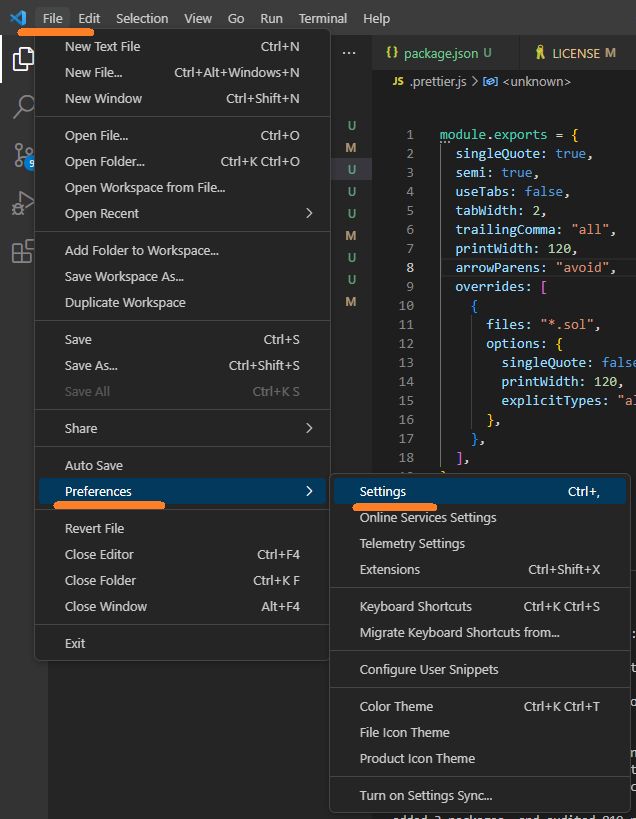
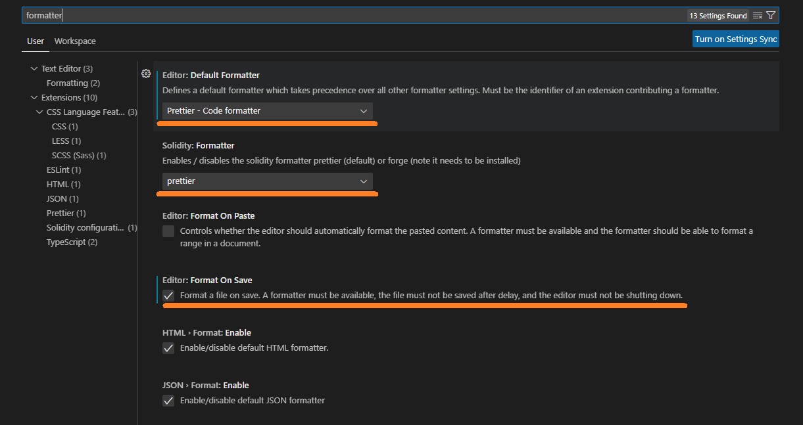

# **섹션 2 - 프로젝트 생성** :gear:

- 섹션 소개

# 빈폴더 생성및 npm packages 설치

- 원하는 위치에 폴더 생성

- VSCode에서 File - Open Folder로 위에서 만든 폴더 선택

- node 프로젝트 시작
    ```
    npm init
    ```

- package.json에 라이브러리 추가하기

    ```
    (TODO)
    ```

# hardhat.config.ts

- hardhat.config.ts 파일추가
    ```
    (TODO)
    ```

# VSCode Extentions

- ESLint 설치

- .eslintrc.js 파일 추가
    ```
    TODO
    ```
- Prettier 설치

- .prettier.js 파일 추가
    ```
    TODO
    ```

- Solidity 설치

- .solhint.json 파일 추가
    ```
    TODO
    ```

- Formatter 설정

    아래 화면을 따라 메뉴를 화면에 띄우고 (단축키는 외워두시면 좋습니다 :heart_eyes:)

    

    아래 설정을 확인합니다.
    
    - Editor: Default Formatter -> Prettier - Code formatter
    - Solidity: Formatter -> prettier
    - Editor: Format On Save -> Check!

    