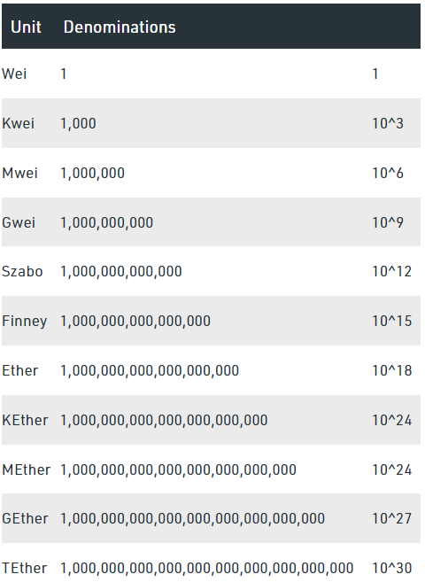

# **Section 4 - Unit Test 만들기** :yum:

- (TODO)

# Unit Test 소개

- Unit Test는 한글로 단위테스트라고 부릅니다.

- 내가 만든 코드를 단위별로 나누어 의도한대로 동작하는지 검증하는 코드입니다.

- Hardhat에는 Hardhat Network라는 내장된 네트웍이 있습니다. Unit Test를 실행하면 자동으로 내 컴퓨터에 이 네트웍이 실행되고 테스트 코드는 이 네트웍에서 실행됩니다.

- 그러므로 Unit Test는 언제든지 실행가능하고 외부에 의존하지 않고 수행할 수 있습니다.

# Unit Test 기본 구조

- UnitTest Template 파일 추가

    - test 폴더 추가
    
    - Unit Test 파일 추가 (Basic.test.ts)
    ```
    import { expect } from 'chai';

    describe('Basic', () => {
        before(async () => {
            console.log('execute before');
        });

        beforeEach(async () => {
            console.log('execute beforeEach');
        });

        it('test', async () => {
            console.log('execute test');
        });

        it('test2 ', async () => {
            console.log('execute test2');

            const str = 'mo mo mo';
            const strArray = str.split(' ');
            expect(strArray.length).to.be.equal(3);

            expect(strArray[0]).to.be.equal('mo');
            expect(strArray[1]).to.be.equal('mo');
            expect(strArray[2]).to.be.equal('mo');
        });
    });
    ```

# Typechain 파일 만들기

- ```npx hardhat typechain```

- typechain 폴더 살펴보기

# Greeter.sol Unit Test 만들기

- Basic.test.ts copy & paste
  
- 파일이름 변경 Greeter.test.ts

- import 추가
    
    ```
    import { ethers, waffle } from 'hardhat';
    import GreeterArtifact from '../artifacts/contracts/Greeter.sol/Greeter.json';
    import { Greeter } from '../typechain/Greeter';
    ```

- Test 계정 가져오기 코드 추가
    
    ```
    const [admin, other] = waffle.provider.getWallets();
    ```

- async/await 간단한 설명

    - NodeJS에서 함수 호출할때 2가지 방식이 있습니다. 한가지는 동기 다른 한가지는 비동기 방식입니다.

    - 함수 하나가 실행시간이 오래 걸릴때 (보통은 네트웍, 파일관련 함수들) NodeJS는 별도의 Thread에서 이 작업을 완료하고 Main Thread에서 결과를 받아 코드를 이어서 수행할 수 있도록 합니다.

    - 복잡한 개념이니 그냥 듣고 잊으셔도 됩니다.

    - 동기 함수 호출예
    
        ```
        const [admin, other] = waffle.provider.getWallets();
        ```
    
    - 비동기 함수 호출예
        ```
        greeter = (await waffle.deployContract(admin, GreeterArtifact, [initMsg])) as Greeter;
        ```

    - 다른 점은 비동기 함수는 함수 호출할때 await 이라는 keyword를 넣습니다.

    - 그럼 await을 붙여야 할지 말아야 할지는 어떻게 알수 있는가? 함수 선언할때 async 키워드가 있으면 await을 넣어주세요. 혹은 함수의 return값이 Promise<???> 이면 await을 붙여주세요.

    - 그래도 혹시 실수로 await을 안 넣었다면??? eslint가 일부 찾아줍니다.


- 테스트 코드 만들기
    
    - contract deploy

    - constructor

    - setGreeting

    - setGreeting with event

    - getGreetingHistory

    - Ether 단위 설명
  
  
    - setGreetingPayable

    - withdraw