# **섹션 7 - Opensea** :boat:

- (TODO)
- :warning: Opensea, Metamask 서비스 변경으로 강의 자료와 맞지 않을수 있음.

- :warning: 이미 Metamask를 사용하셨던분이거나 Opensea를 이용해 보신분들은 강의 내용과 조금 다른 스텝을 만날수 있습니다. 어떤 화면이 나오시던지 예나 다음, 수락등의 긍정적인 버턴을 누르시면 문제 없이 넘어가실수 있습니다. 
  
# Opensea & Metamask 소개

- Opensea
    
    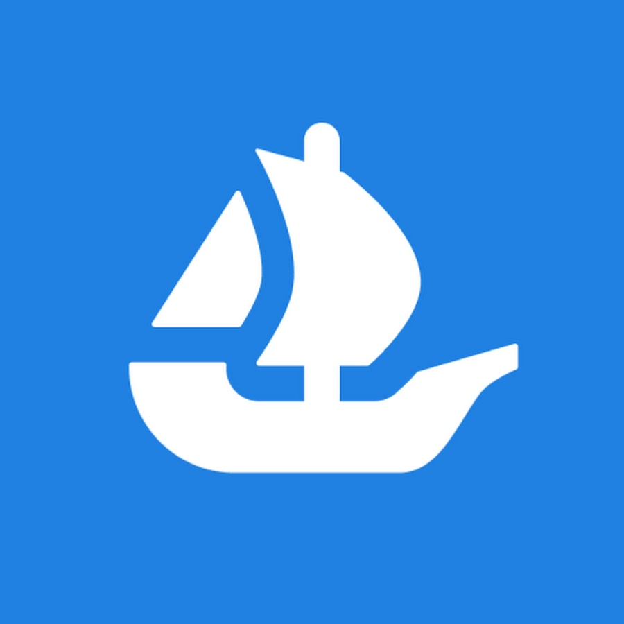

    - Opensea는 NFT 거래를 지원하는 마켓입니다. 현재(2023-02-01) Ethereum, Polygon, Klaytn, Solana, Arbitrum, Optimism, Avalanche, BNB 네트웍을 지원하고 있습니다.

    - 가장 유명한 NFT 마켓 플레이스


- Metamask
    - Metamask는 Wallet입니다. EOA를 생성및 관리해주고 특정 서비스를 이용할때 Metamask가 서명및 API 호출을 담당해 줍니다.
    - 나 <-> BApp <-> ***Metamask*** <-> Network
    - 많은 EVM 호환네트웍에서 운영되는 프로젝트들은 모두 Metamask를 기본으로 연동해 주고 있으니 이 wallet을 이용하여 Opensea를 이용하겠습니다.

    - PC와 Mobile을 지원하고 있고 여기서는 PC버전을 다루겠습니다.

    - Metamask는 여러 브라우저를 지원하지만 여기서는 크롬을 사용하겠습니다.

# Metamask 설치

- 크롬에서 [Metamask Download](https://metamask.io/download/) 페이지로 이동

- Install MetaMask for Chrome 클릭!
  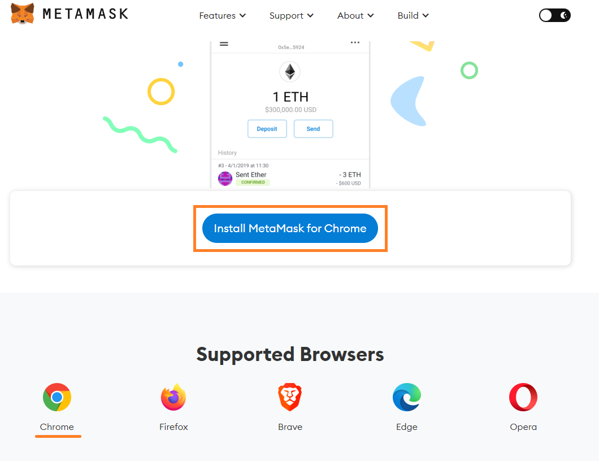

- Chrome에 추가 버턴 클릭 -> 확장 프로그램 추가 버턴 클릭
  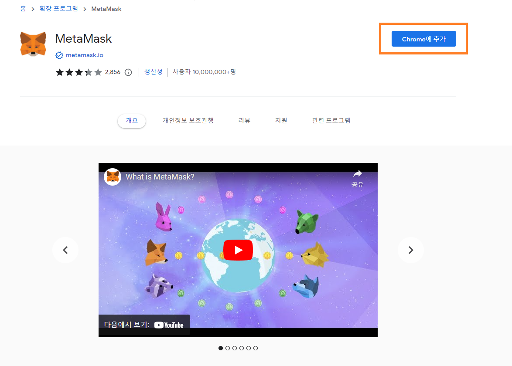

- 기존 지갑 가져오기 클릭 -> Agree 버턴 클릭
  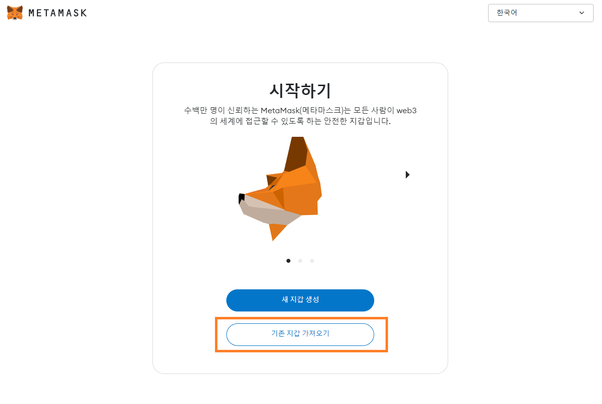

- .env 파일에 저장해둔 MNEMONIC 단어 12개를 입력하고 비밀복구 구문확인 버턴 클릭
  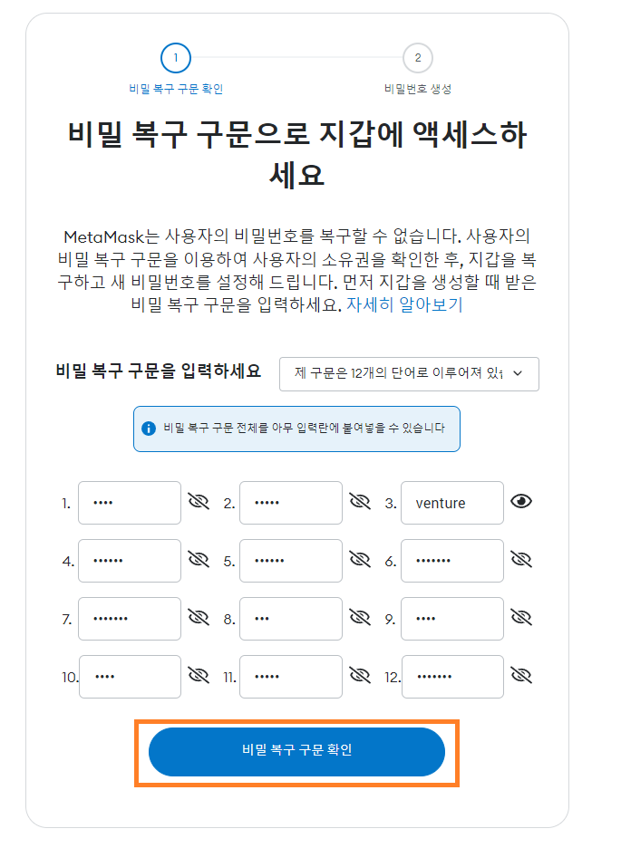

- 패스워드 입력하고 Metamask 어쩌구 CheckBox 클릭. 내 지갑 가져오기 클릭
  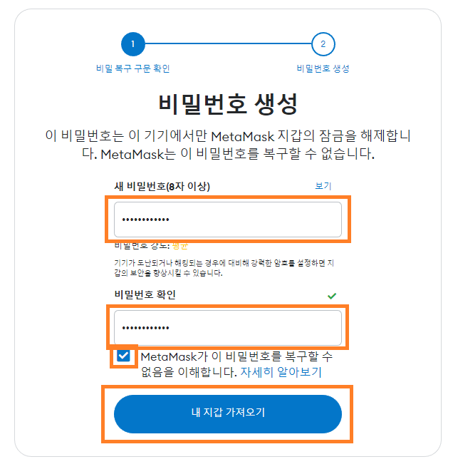

- Metamask 창 닫기

- 크롬 오른쪽 상단의 Extension 버턴을 클릭하고 항상 표시 되도록 고정하기
  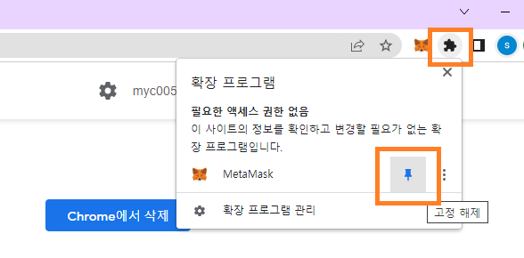

- Metamask 버턴을 클릭후 Account 1을 클릭하여 주소를 클립보드로 복사하고 내 Public key와 같은지 확인
  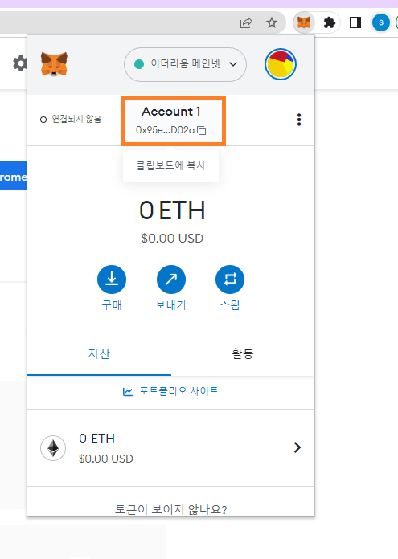

- 완료!!!!

# Edit My Collection

- Collection은 한 NFT 컨트랙트에서 Mint된 NFT들의 모음입니다. 내 NFT의 홈페이지 같은거라고 보시면 될거 같습니다.

- 크롬에서 [Opensea testnet](https://testnets.opensea.io/)으로 이동

- Monkey NFT Collection 페이지로 이동 - 아직은 지갑연결을 하지 않았기 때문에 Edit (Collection) 버턴이 없음
    
    ```Opensea 상단 검색창에 내 Monkey contract address 입력하고 Enter key 누르기```

- Opensea 우측 상단의 지갑버턴 클릭
    
    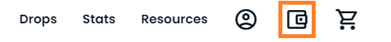

- Metamask 클릭

    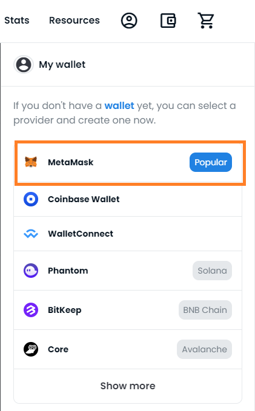

- 다음 클릭

  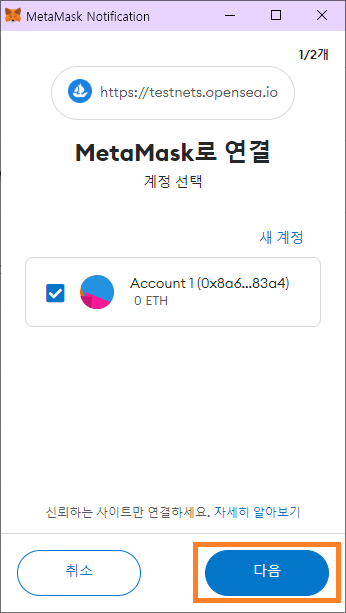

- 연결 클릭

    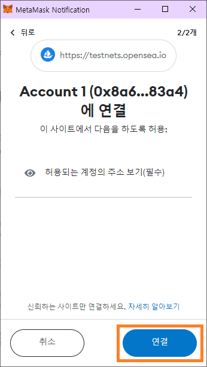

- Accept and Sign 클릭

    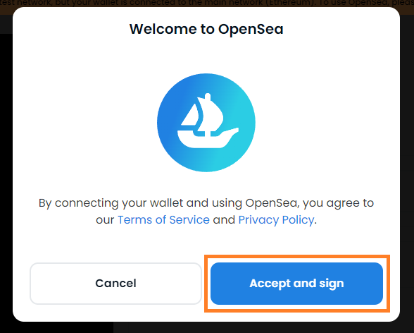

- 네트웍 추가 혹은 전환

    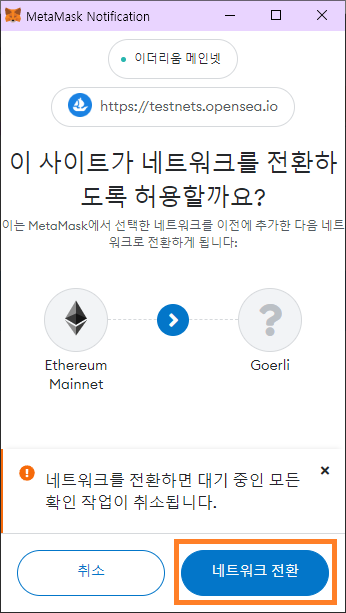

- 서명 클릭

    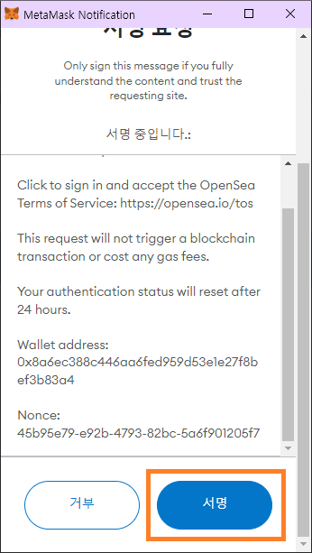

- Opensea에서 어떤 버턴을 눌러도 진행되지 않는다면 크롬 우측 상단 Metamask 버턴에 1 뱃지가 있는지 확인

    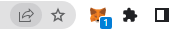

- Monkey Collection 페이지로 이동

- Edit 버턴 클릭
    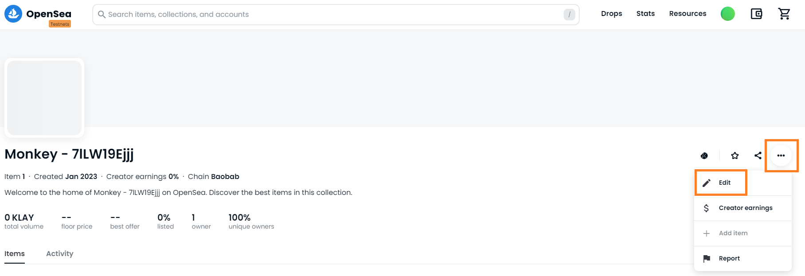

- Log image, Featured image

    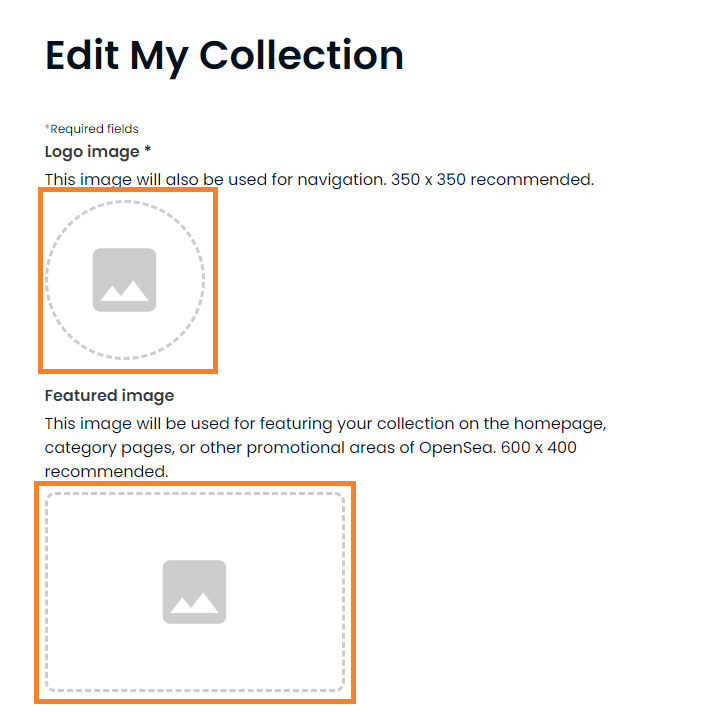

- Banner image, Name

    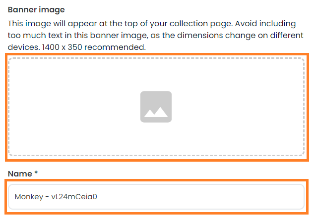

- Description, Category

    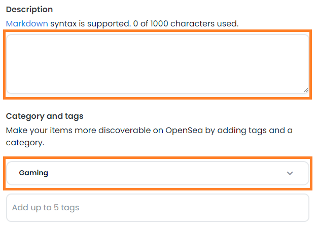

- Creator earnings

    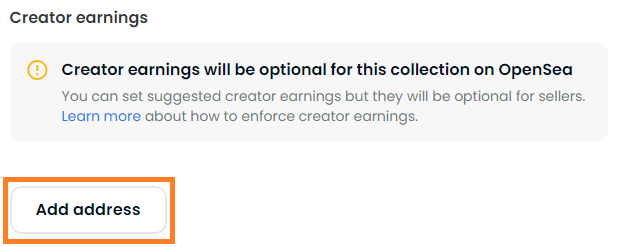

    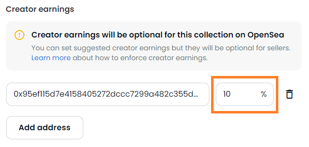

- Payment tokens

    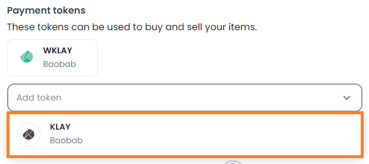

- Collaborators

    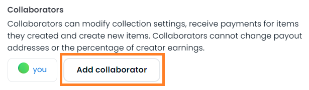

- Submit changes 버턴 클릭

- My Collection 확인
